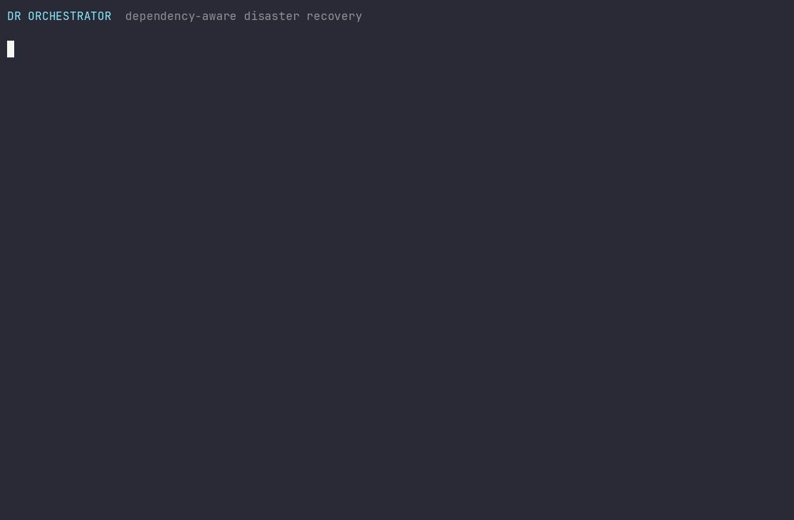

# DR Orchestrator

[](https://github.com/gandara-dev/dr-orchestrator/actions/workflows/ci.yml)
[](https://learn.microsoft.com/powershell/)
[](LICENSE)

Dependency-aware disaster recovery runbooks for VMware and Windows recovery
workflows. DR Orchestrator validates a versioned YAML graph, executes recovery
steps in a stable dependency order, blocks unsafe downstream work after a
failure, and produces a measured Markdown and HTML timeline.

> [!IMPORTANT]
> The included environment, names, and timings are synthetic. Simulation tests
> orchestration behavior; it does not predict production RTO or replace a
> recovery exercise.



## Why this project exists

Traditional recovery documents often mix dependencies, commands, credentials,
and operator decisions in one long checklist. That makes ordering hard to test
and failures easy to propagate. DR Orchestrator separates those concerns:

- the runbook describes dependencies and provider actions;
- validation rejects invalid graphs and action parameters before execution;
- the engine records state and measured duration for every step;
- providers perform narrowly scoped VMware or Windows operations;
- reports create a portable audit trail without embedding credentials.

## Architecture



The engine is intentionally sequential. Recovery teams can inspect a single,
deterministic timeline, while independent branches continue after an unrelated
branch fails. See [Architecture](docs/architecture.md) for lifecycle, state, and
trust-boundary details.

## Two-minute quick start

Requirements: PowerShell 7.2 or newer. No VMware or Windows infrastructure is
contacted in simulation mode.

```powershell
git clone https://github.com/gandara-dev/dr-orchestrator.git
cd dr-orchestrator

Install-Module powershell-yaml -RequiredVersion 0.4.12 -Scope CurrentUser
Import-Module ./src/DrOrchestrator/DrOrchestrator.psd1

$execution = Invoke-DrRunbook ./runbooks/site-recovery.yml -Simulation
$execution | Format-List RunbookName, Status, Simulation, ElapsedMilliseconds
Export-DrReport -Execution $execution -OutputDirectory ./artifacts
```

The command creates `artifacts/report.md` and `artifacts/report.html`. Reported
duration is measured wall-clock time for that execution.

Inject a controlled failure to verify dependency behavior:

```powershell
$execution = Invoke-DrRunbook `
    -Path ./runbooks/site-recovery.yml `
    -Simulation `
    -InjectFailureStepId start-sql

$execution.Steps | Format-Table Id, Status, DurationMilliseconds, Message
```

`start-sql` becomes `Failed`; dependent SQL, Delivery Controller, StoreFront,
and VDA work becomes `Blocked`. An independent branch would continue.

## Run against infrastructure

Install the current VCF PowerCLI package, authenticate outside the runbook, and
then execute without `-Simulation`:

```powershell
Install-Module VCF.PowerCLI -Scope CurrentUser
$credential = Get-Credential
Connect-VIServer -Server vcenter.example.test -Credential $credential

Import-Module ./src/DrOrchestrator/DrOrchestrator.psd1
$execution = Invoke-DrRunbook -Path ./runbooks/site-recovery.yml
Export-DrReport -Execution $execution -OutputDirectory ./artifacts

if ($execution.Status -ne 'Succeeded') {
    throw 'Recovery runbook did not complete successfully.'
}

Disconnect-VIServer -Server * -Confirm:$false
```

VMware steps use only an already authenticated PowerCLI session. The module
does not accept or persist a vCenter password. Windows `StartService` uses the
caller's PowerShell remoting context; TCP and HTTP health checks originate from
the orchestrator host.

Run the same revision in simulation and a non-production recovery environment
before production use. Read the [Operations guide](docs/operations-guide.md)
for preparation, execution, evidence handling, and rollback boundaries.

## Supported actions

| Provider | Action | Purpose |
|---|---|---|
| VMware | `StartVM` | Power on one or more VMs when required |
| VMware | `WaitForTools` | Wait for VMware Tools with a configurable timeout |
| VMware | `TestVM` | Require every listed VM to be powered on |
| Windows | `StartService` | Start and wait for a service through PowerShell remoting |
| Windows | `TestTcpPort` | Test TCP reachability from the orchestrator host |
| Windows | `TestHttp` | Require a successful HTTP or HTTPS response |

Provider/action combinations, required parameters, duplicate IDs, unknown
dependencies, self-dependencies, and cycles are rejected before a run starts.
The complete contract is in the [Runbook reference](docs/runbook-reference.md)
and machine-readable [JSON Schema](schemas/runbook.schema.json).

## Documentation

| Document | Contents |
|---|---|
| [Architecture](docs/architecture.md) | Components, execution lifecycle, status model, result contract, trust boundaries |
| [Runbook reference](docs/runbook-reference.md) | YAML fields, actions, parameters, dependency rules, validation |
| [Operations guide](docs/operations-guide.md) | Production preparation, credentials, execution, failure handling, reports |
| [Testing guide](docs/testing.md) | Unit and vcsim integration tests, CI behavior, demo reproduction |
| [Release verification](docs/release-verification.md) | Public release gate and required environment acceptance |
| [Security policy](SECURITY.md) | Security assumptions, secret handling, reporting vulnerabilities |
| [Contributing](CONTRIBUTING.md) | Development workflow and acceptance criteria |

## Test locally

```powershell
Install-Module Pester -RequiredVersion 5.7.1 -Scope CurrentUser -Force -SkipPublisherCheck
Install-Module powershell-yaml -RequiredVersion 0.4.12 -Scope CurrentUser
Invoke-Pester ./tests/DrOrchestrator.Tests.ps1 -Output Detailed
```

CI runs unit tests on Windows and Linux, PSScriptAnalyzer, and an integration
test that performs a real `Start-VM` call against a disposable VMware `vcsim`
instance. It never requires a production vCenter. See the
[Testing guide](docs/testing.md) for the exact local integration command.

## Project layout

```text
.
|-- runbooks/                   Synthetic example runbook
|-- schemas/                    JSON Schema for editor and CI validation
|-- src/DrOrchestrator/         PowerShell module
|   |-- Public/                 Exported commands
|   `-- Private/                Parser, providers, and report renderer
|-- tests/                      Unit and vcsim integration tests
|-- demo/                       Reproducible terminal recording generator
`-- docs/                       Demo and technical documentation
```

## Current scope

Version `0.1.2` executes steps sequentially and does not implement retries,
parallel branches, automatic rollback, credential storage, or remote evidence
collection. These are explicit safety boundaries, not implicit promises.

## License

[MIT](LICENSE)
