# Architecture

This document describes the internal design and operational boundaries of DR
Orchestrator `0.1.1`.

## Design goals

- Make recovery order explicit and reviewable in source control.
- Reject invalid dependency graphs before any provider operation occurs.
- Keep credentials outside runbook files and execution reports.
- Produce deterministic ordering and a single measured timeline.
- Allow orchestration logic to be tested without infrastructure.
- Keep provider actions small enough to reason about and mock.

## Components

### Import and validation

`Import-DrRunbook` parses YAML with `powershell-yaml`, normalizes every field to
a predictable PowerShell object, and performs semantic validation. Validation
includes:

- required top-level and step fields;
- runbook schema version;
- case-insensitive step-ID uniqueness;
- supported provider/action combinations;
- required action parameters and basic value ranges;
- known dependencies and no self-dependency.

The JSON Schema provides editor and external-tool validation. The PowerShell
validator remains authoritative at runtime because JSON Schema cannot express
graph properties such as an unknown dependency or a cycle.

### Stable dependency ordering

`Get-DrExecutionOrder` performs a stable topological sort. On each pass it picks
the first declaration whose dependencies have already been placed. Therefore:

- dependencies always precede their consumers;
- unrelated steps retain their YAML declaration order;
- a graph with no eligible next step is rejected as cyclic.

The current implementation favors transparent behavior over maximum throughput.
It is appropriate for human-scale recovery runbooks and does not run steps in
parallel.

### Execution engine

`Invoke-DrRunbook` owns orchestration state. For each ordered step it first
checks dependency states. If any prerequisite is not `Succeeded`, the engine
records the step as `Blocked` without invoking a provider. Otherwise it invokes
the selected provider and records timing and outcome.

Provider exceptions are contained at the step boundary and converted to a
`Failed` result. Execution then continues so independent branches can complete.
The engine never retries or rolls back automatically in version `0.1.1`.

## Step state model

The overall run is `Failed` when at least one step is `Failed`. A run containing
only `Succeeded` steps is `Succeeded`. `Blocked` steps are consequences of a
failed prerequisite; they do not independently change the overall calculation.

## Execution result contract

`Invoke-DrRunbook` returns one object with these fields:

| Field | Type | Meaning |
|---|---|---|
| `RunbookName` | string | Name from the normalized runbook |
| `Status` | string | `Succeeded` or `Failed` |
| `Simulation` | boolean | Whether all provider actions were simulated |
| `StartedAt` | DateTimeOffset | UTC timestamp of the first step |
| `CompletedAt` | DateTimeOffset | UTC timestamp after orchestration ends |
| `ElapsedMilliseconds` | number | Measured total wall-clock time |
| `Steps` | object[] | Ordered per-step results |

Each step result contains `Id`, `Name`, `Provider`, `Action`, `Status`, `Message`,
`StartedAt`, `CompletedAt`, and `DurationMilliseconds`.

The command returns a result even when providers fail. Automation must inspect
`Status` and explicitly fail its pipeline when a recovery did not succeed.

## Provider boundaries

### VMware

The VMware provider imports no credentials. It requires `VCF.PowerCLI` and
selects an already connected server from PowerCLI's session variables. An
optional `parameters.server` value narrows the session selection. A missing
session fails explicitly and never opens an interactive credential prompt.

### Windows

`StartService` uses `Invoke-Command`, so authentication and authorization are
owned by the caller's PowerShell remoting context. `TestTcpPort` and `TestHttp`
run locally on the orchestrator host and therefore measure reachability from
that network position.

### Simulation

Simulation bypasses both infrastructure providers after the entire runbook has
been parsed, semantically validated, and ordered. Injected failures are matched
case-insensitively by step ID. This validates dependency behavior but cannot
validate infrastructure names, permissions, certificates, or application
readiness.

## Report safety

Markdown table delimiters and line breaks are escaped. HTML-controlled text is
encoded with `System.Net.WebUtility.HtmlEncode` before rendering. Reports may
still contain infrastructure names and provider error text, so operators must
treat them as operational evidence and apply appropriate retention controls.

## Trust boundaries

The repository is trusted as executable configuration. The orchestrator host
holds live sessions and network access. vCenter, remote Windows hosts, health
endpoints, and the report filesystem are external trust boundaries. Runbook
changes should receive the same review as infrastructure code.
