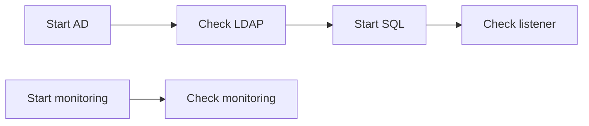

# Runbook reference

DR Orchestrator accepts YAML runbooks with schema version `1`. Use
[`schemas/runbook.schema.json`](../schemas/runbook.schema.json) for editor
validation and [`runbooks/site-recovery.yml`](../runbooks/site-recovery.yml) as
a complete synthetic example.

## Top-level fields

| Field | Required | Type | Description |
|---|---:|---|---|
| `name` | yes | string | Human-readable runbook name |
| `version` | yes | integer | Must be `1` |
| `description` | no | string | Purpose and scope |
| `steps` | yes | array | One or more recovery steps |

## Step fields

| Field | Required | Type | Description |
|---|---:|---|---|
| `id` | yes | string | Case-insensitively unique stable identifier |
| `name` | yes | string | Operator-facing description |
| `provider` | yes | string | `VMware` or `Windows` |
| `action` | yes | string | Provider-specific action |
| `dependsOn` | no | string[] | Step IDs that must all succeed first |
| `parameters` | yes | object | Provider/action parameters |

IDs should match `^[a-zA-Z0-9][a-zA-Z0-9_-]*$`. Renaming an ID is a behavioral
change because dependencies and failure-injection tests refer to it.

## VMware actions

### `StartVM`

Powers on every VM that is not already powered on.

```yaml
- id: start-database
  name: Start database VMs
  provider: VMware
  action: StartVM
  parameters:
    server: vcenter.example.test       # optional session selector
    vmNames:                           # required
      - dr-db01
      - dr-db02
```

### `WaitForTools`

Waits for VMware Tools on every listed VM. `timeoutSeconds` defaults to `300`
when omitted.

```yaml
- id: wait-for-database-guest
  name: Wait for database guest readiness
  provider: VMware
  action: WaitForTools
  dependsOn: [start-database]
  parameters:
    vmNames: [dr-db01, dr-db02]
    timeoutSeconds: 600
```

This action checks VMware Tools, not application health.

### `TestVM`

Requires every listed VM to report `PoweredOn`.

```yaml
- id: verify-database-vms
  name: Verify database VM power state
  provider: VMware
  action: TestVM
  dependsOn: [start-database]
  parameters:
    vmNames: [dr-db01, dr-db02]
```

## Windows actions

### `StartService`

Uses PowerShell remoting to start a service when needed, then waits up to 60
seconds for `Running`.

```yaml
- id: start-app-service
  name: Start application service
  provider: Windows
  action: StartService
  parameters:
    computerName: app01.example.test
    serviceName: ExampleService
```

Required parameters: `computerName`, `serviceName`.

### `TestTcpPort`

Opens a TCP connection from the orchestrator host. `timeoutSeconds` defaults to
`5` when omitted.

```yaml
- id: check-database-listener
  name: Check database listener
  provider: Windows
  action: TestTcpPort
  dependsOn: [start-database]
  parameters:
    computerName: db-listener.example.test
    port: 1433
    timeoutSeconds: 15
```

Required parameters: `computerName`, `port` in the range `1` through `65535`.

### `TestHttp`

Sends an HTTP request from the orchestrator host. A transport failure or status
code `400` and above fails the step. `timeoutSeconds` defaults to `10`.

```yaml
- id: check-portal
  name: Check portal health
  provider: Windows
  action: TestHttp
  dependsOn: [start-app-service]
  parameters:
    uri: https://portal.example.test/health
    timeoutSeconds: 20
```

`uri` must be an absolute HTTP or HTTPS URI. Redirect and certificate behavior
follows `Invoke-WebRequest` on the orchestrator host.

## Dependency semantics

Every value in `dependsOn` is an AND dependency: all listed steps must be
`Succeeded`. A failed or blocked prerequisite blocks its consumer. Unrelated
branches remain eligible and retain declaration order.



If `Start SQL` fails, `Check listener` is blocked while the monitoring branch
continues.

## Validation behavior

Import rejects the runbook before provider execution when it finds:

- missing or empty required fields;
- an unsupported schema version, provider, or action;
- missing action parameters or invalid port, timeout, or URI values;
- duplicate IDs, including IDs that differ only by case;
- a missing dependency or self-dependency;
- a dependency cycle.

JSON Schema validation is complementary. Runtime validation is required because
schema alone cannot validate cross-step graph references.

## Variables and secrets

Version `1` does not implement templating, variable substitution, or secret
fields. Do not place credentials in YAML. Establish PowerCLI and PowerShell
remoting authentication before invoking the runbook.
